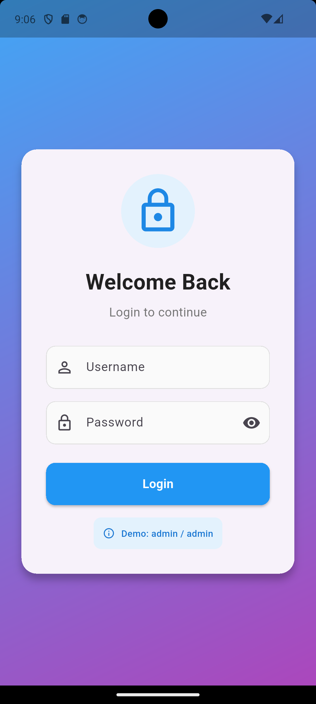
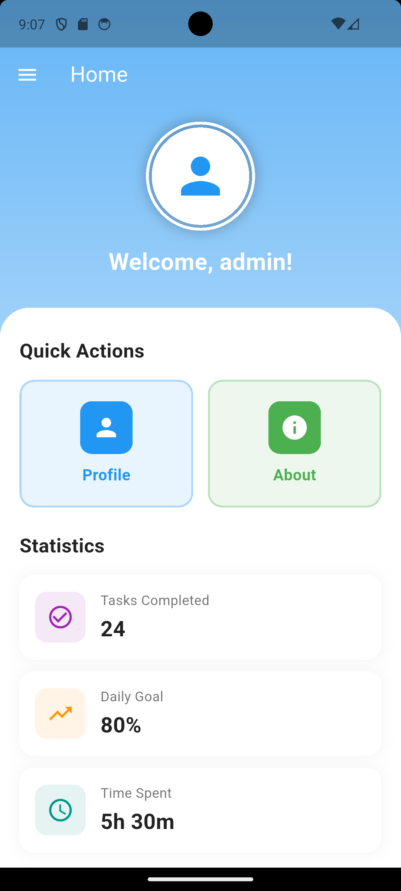
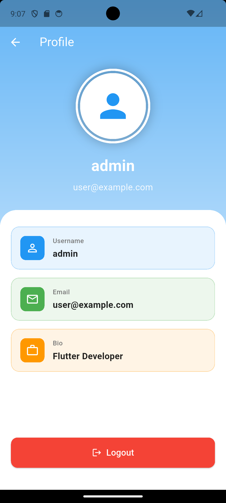
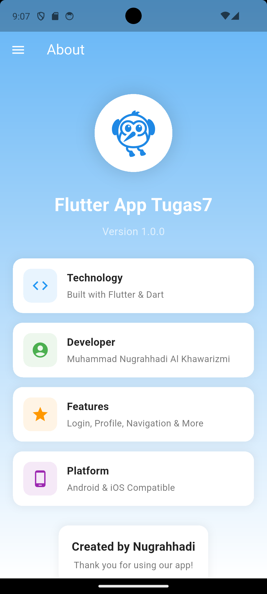
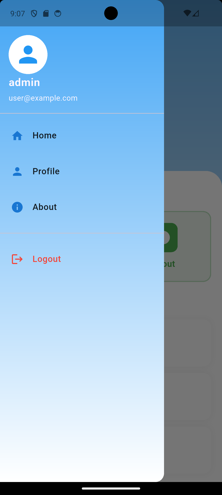
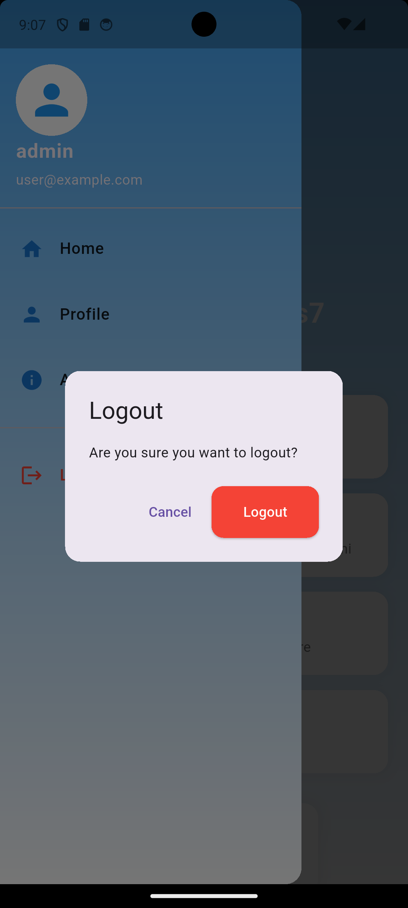

# Identitas Mahasiswa

---

## Nama: Muhammad Nugrahhadi Al Khawarizmi

## NIM: H1D023055

## Shift: A

## 📂 Struktur Proyek

```
lib/
├── main.dart              # Entry point aplikasi
├── splash_screen.dart     # Layar pembuka dengan animasi
├── login_page.dart        # Halaman login
├── home_page.dart         # Halaman utama
├── profile_page.dart      # Halaman profil
├── about_page.dart        # Halaman tentang aplikasi
└── sidemenu.dart          # Menu navigasi drawer
```

## 📖 Penjelasan Kode

### 1. main.dart

File utama yang menjadi entry point aplikasi Flutter ini.

**Struktur Utama:**

```dart
void main() {
  runApp(const MyApp());
}

class MyApp extends StatelessWidget {
  const MyApp({super.key});

  @override
  Widget build(BuildContext context) {
    return MaterialApp(
      title: 'Flutter Demo',
      theme: ThemeData(
        primarySwatch: Colors.blue,
        useMaterial3: true,
        cardTheme: CardThemeData(
          elevation: 4,
          shape: RoundedRectangleBorder(
            borderRadius: BorderRadius.circular(15),
          ),
        ),
      ),
      initialRoute: '/',
      routes: {
        '/': (context) => const SplashScreen(),
        '/login': (context) => const LoginPage(),
        '/home': (context) => const HomePage(),
        '/about': (context) => const AboutPage(),
        '/profile': (context) => const ProfilePage(),
      },
    );
  }
}
```

**Penjelasan Kode:**

- `main()`: Fungsi entry point yang menjalankan aplikasi
- `MyApp`: StatelessWidget yang mengatur konfigurasi aplikasi
- `MaterialApp`: Widget root yang menyediakan tema, routing, dan konfigurasi aplikasi
- `ThemeData`: Mengatur tema dengan Material Design 3 dan konfigurasi card
- `routes`: Map yang mendefinisikan named routes untuk navigasi

---

### 2. splash_screen.dart

Halaman splash screen dengan animasi fade dan scale.

**Struktur Kelas:**

```dart
class SplashScreen extends StatefulWidget {
  const SplashScreen({super.key});

  @override
  State<SplashScreen> createState() => _SplashScreenState();
}

class _SplashScreenState extends State<SplashScreen> with TickerProviderStateMixin {
  late AnimationController _animationController;
  late Animation<double> _fadeAnimation;
  late Animation<double> _scaleAnimation;

  @override
  void initState() {
    super.initState();
    _initializeAnimations();
    _navigateToLogin();
  }

  void _initializeAnimations() {
    _animationController = AnimationController(
      duration: const Duration(milliseconds: 1500),
      vsync: this,
    );

    _fadeAnimation = Tween<double>(begin: 0.0, end: 1.0).animate(
      CurvedAnimation(parent: _animationController, curve: Curves.easeIn),
    );

    _scaleAnimation = Tween<double>(begin: 0.5, end: 1.0).animate(
      CurvedAnimation(parent: _animationController, curve: Curves.elasticOut),
    );

    _animationController.forward();
  }

  void _navigateToLogin() {
    Timer(const Duration(seconds: 3), () {
      Navigator.pushReplacementNamed(context, '/login');
    });
  }

  @override
  void dispose() {
    _animationController.dispose();
    super.dispose();
  }
}
```

**Penjelasan Kode:**

- `TickerProviderStateMixin`: Diperlukan untuk AnimationController
- `initState()`: Inisialisasi animasi dan timer navigasi
- `_initializeAnimations()`: Setup AnimationController dan Tween animations
- `_navigateToLogin()`: Timer 3 detik untuk auto-navigasi ke login
- `dispose()`: Membersihkan AnimationController untuk mencegah memory leak

---

### 3. login_page.dart

Halaman login dengan form input dan validasi.

**State Management:**

```dart
class _LoginPageState extends State<LoginPage> with TickerProviderStateMixin {
  final TextEditingController _usernameController = TextEditingController();
  final TextEditingController _passwordController = TextEditingController();
  bool _isPasswordVisible = false;
  bool _isLoading = false;
  late AnimationController _animationController;
  late Animation<double> _fadeAnimation;

  @override
  void initState() {
    super.initState();
    _animationController = AnimationController(
      duration: const Duration(milliseconds: 1000),
      vsync: this,
    );
    _fadeAnimation = Tween<double>(begin: 0.0, end: 1.0).animate(
      CurvedAnimation(parent: _animationController, curve: Curves.easeIn),
    );
    _animationController.forward();
  }

  @override
  void dispose() {
    _animationController.dispose();
    _usernameController.dispose();
    _passwordController.dispose();
    super.dispose();
  }
}
```

**Penjelasan Kode:**

- `TextEditingController`: Mengelola state input text field
- Boolean states: `_isPasswordVisible` untuk toggle password, `_isLoading` untuk loading indicator
- AnimationController: Untuk animasi fade in card login

**Fungsi Login:**

```dart
void _login() async {
  if (_usernameController.text.isEmpty || _passwordController.text.isEmpty) {
    _showSnackBar('Please enter username and password', Colors.red);
    return;
  }

  setState(() => _isLoading = true);
  await Future.delayed(const Duration(seconds: 1)); // Simulate API call
  setState(() => _isLoading = false);

  if (_usernameController.text == 'admin' && _passwordController.text == 'admin') {
    await _saveUsername();
    if (!mounted) return;
    Navigator.pushReplacementNamed(context, '/home');
  } else {
    _showSnackBar('Invalid username or password', Colors.red);
  }
}

void _saveUsername() async {
  SharedPreferences prefs = await SharedPreferences.getInstance();
  await prefs.setString('username', _usernameController.text);
}

void _showSnackBar(String message, Color color) {
  ScaffoldMessenger.of(context).showSnackBar(
    SnackBar(
      content: Text(message),
      backgroundColor: color,
      behavior: SnackBarBehavior.floating,
      shape: RoundedRectangleBorder(
        borderRadius: BorderRadius.circular(10),
      ),
    ),
  );
}
```

**Penjelasan Kode:**

- `_login()`: Validasi input, loading state, autentikasi sederhana, navigasi
- `_saveUsername()`: Menyimpan username ke SharedPreferences
- `_showSnackBar()`: Menampilkan pesan feedback dengan custom styling

---

### 4. home_page.dart

Dashboard utama dengan cards aksi dan statistik.

**Load Data:**

```dart
class _HomePageState extends State<HomePage> {
  String? username;

  @override
  void initState() {
    super.initState();
    _loadUsername();
  }

  void _loadUsername() async {
    SharedPreferences prefs = await SharedPreferences.getInstance();
    setState(() {
      username = prefs.getString('username');
    });
  }
}
```

**Penjelasan Kode:**

- `initState()`: Dipanggil saat widget pertama kali dibuat
- `_loadUsername()`: Mengambil data dari SharedPreferences dan update UI

**Statistics Cards:**

```dart
Widget _buildStatCard({
  required IconData icon,
  required String title,
  required String value,
  required Color color,
}) {
  return Container(
    padding: const EdgeInsets.all(16),
    decoration: BoxDecoration(
      color: Colors.white,
      borderRadius: BorderRadius.circular(15),
      boxShadow: [
        BoxShadow(
          color: Colors.grey.withOpacity(0.1),
          blurRadius: 10,
          spreadRadius: 2,
        ),
      ],
    ),
    child: Row(
      children: [
        Container(
          padding: const EdgeInsets.all(12),
          decoration: BoxDecoration(
            color: color.withOpacity(0.1),
            borderRadius: BorderRadius.circular(12),
          ),
          child: Icon(icon, color: color, size: 28),
        ),
        const SizedBox(width: 15),
        Expanded(
          child: Column(
            crossAxisAlignment: CrossAxisAlignment.start,
            children: [
              Text(
                title,
                style: TextStyle(fontSize: 14, color: Colors.grey.shade600),
              ),
              const SizedBox(height: 4),
              Text(
                value,
                style: const TextStyle(
                  fontSize: 22,
                  fontWeight: FontWeight.bold,
                ),
              ),
            ],
          ),
        ),
      ],
    ),
  );
}
```

Card untuk menampilkan statistik.

---

### 5. profile_page.dart

Halaman profil dengan informasi user dan logout.

**Load User Data:**

```dart
class _ProfilePageState extends State<ProfilePage> {
  String? username;

  @override
  void initState() {
    super.initState();
    _loadUserData();
  }

  void _loadUserData() async {
    SharedPreferences prefs = await SharedPreferences.getInstance();
    setState(() {
      username = prefs.getString('username') ?? 'Guest';
    });
  }
}
```

**Logout Function:**

```dart
void _logout() async {
  SharedPreferences prefs = await SharedPreferences.getInstance();
  await prefs.clear();

  if (!mounted) return;
  Navigator.pushNamedAndRemoveUntil(context, '/login', (route) => false);
}
```

**Penjelasan Kode:**

- Hapus semua data dari SharedPreferences
- Cek `mounted` untuk safety setelah async operation
- `pushNamedAndRemoveUntil`: Navigasi ke login dan hapus semua route sebelumnya

---

### 6. about_page.dart

Halaman informasi aplikasi dengan cards informatif.

**Info Cards:**

```dart
Widget _buildInfoCard({
  required IconData icon,
  required String title,
  required String description,
  required Color color,
}) {
  return Container(
    padding: const EdgeInsets.all(16),
    decoration: BoxDecoration(
      color: Colors.white,
      borderRadius: BorderRadius.circular(15),
      boxShadow: [
        BoxShadow(
          color: Colors.black.withOpacity(0.05),
          blurRadius: 10,
          spreadRadius: 2,
        ),
      ],
    ),
    child: Row(
      children: [
        Container(
          padding: const EdgeInsets.all(12),
          decoration: BoxDecoration(
            color: color.withOpacity(0.1),
            borderRadius: BorderRadius.circular(12),
          ),
          child: Icon(icon, color: color, size: 28),
        ),
        const SizedBox(width: 15),
        Expanded(
          child: Column(
            crossAxisAlignment: CrossAxisAlignment.start,
            children: [
              Text(
                title,
                style: const TextStyle(
                  fontSize: 16,
                  fontWeight: FontWeight.bold,
                ),
              ),
              const SizedBox(height: 4),
              Text(
                description,
                style: TextStyle(
                  fontSize: 14,
                  color: Colors.grey.shade600,
                ),
              ),
            ],
          ),
        ),
      ],
    ),
  );
}
```

Card dengan icon, judul, dan deskripsi untuk menampilkan informasi aplikasi.

---

### 7. sidemenu.dart

Drawer navigation menu dengan user info dan menu items.

**Stateful Widget untuk Dynamic Data:**

```dart
class _SidemenuState extends State<Sidemenu> {
  String? username;

  @override
  void initState() {
    super.initState();
    _loadUsername();
  }

  void _loadUsername() async {
    SharedPreferences prefs = await SharedPreferences.getInstance();
    setState(() {
      username = prefs.getString('username');
    });
  }
}
```

**UserAccountsDrawerHeader:**

```dart
UserAccountsDrawerHeader(
  decoration: const BoxDecoration(color: Colors.transparent),
  currentAccountPicture: const CircleAvatar(
    backgroundColor: Colors.white,
    child: Icon(Icons.person, size: 50, color: Colors.blue),
  ),
  accountName: Text(
    username ?? 'Guest',
    style: const TextStyle(
      fontSize: 20,
      fontWeight: FontWeight.bold,
    ),
  ),
  accountEmail: const Text(
    'user@example.com',
    style: TextStyle(fontSize: 14),
  ),
)
```

Header drawer dengan avatar dan informasi user.

**Logout Dialog:**

```dart
void _logout() async {
  showDialog(
    context: context,
    builder: (context) => AlertDialog(
      title: const Text('Logout'),
      content: const Text('Are you sure you want to logout?'),
      shape: RoundedRectangleBorder(
        borderRadius: BorderRadius.circular(15),
      ),
      actions: [
        TextButton(
          onPressed: () => Navigator.pop(context),
          child: const Text('Cancel'),
        ),
        ElevatedButton(
          onPressed: () async {
            SharedPreferences prefs = await SharedPreferences.getInstance();
            await prefs.clear();
            if (!mounted) return;
            Navigator.pushNamedAndRemoveUntil(
              context,
              '/login',
              (route) => false,
            );
          },
          style: ElevatedButton.styleFrom(
            backgroundColor: Colors.red,
            foregroundColor: Colors.white,
          ),
          child: const Text('Logout'),
        ),
      ],
    ),
  );
}
```

**Menu Items:**

```dart
Widget _buildMenuItem({
  required IconData icon,
  required String title,
  required VoidCallback onTap,
  Color? iconColor,
  Color? textColor,
}) {
  return ListTile(
    leading: Icon(icon, color: iconColor ?? Colors.blue.shade700),
    title: Text(title, style: TextStyle(
      fontSize: 16,
      fontWeight: FontWeight.w500,
      color: textColor ?? Colors.black87,
    )),
    onTap: onTap,
    shape: RoundedRectangleBorder(
      borderRadius: BorderRadius.circular(10),
    ),
    contentPadding: const EdgeInsets.symmetric(horizontal: 20, vertical: 5),
  );
}
```

---

```dart
Navigator.pushReplacementNamed(context, '/home')
Navigator.pushNamed(context, '/profile')
Navigator.pushNamedAndRemoveUntil(...)
```

---

## Routing System

Aplikasi menggunakan named routes untuk navigasi:

**Definisi Routes (main.dart):**

```dart
routes: {
  '/': (context) => const SplashScreen(),
  '/login': (context) => const LoginPage(),
  '/home': (context) => const HomePage(),
  '/about': (context) => const AboutPage(),
  '/profile': (context) => const ProfilePage(),
},
```

**Navigasi:**

```dart
Navigator.pushNamed(context, '/profile')
Navigator.pushReplacementNamed(context, '/home')
Navigator.pushNamedAndRemoveUntil(context, '/login', ...)
```

---

## Screenshots

### 1. Halaman Login



Halaman autentikasi pengguna dengan form input username dan password, serta tombol login.

### 2. Halaman Utama (Dashboard)



Dashboard utama setelah login yang menampilkan cards aksi, statistik, dan informasi pengguna.

### 3. Halaman Profile



Halaman profil pengguna yang menampilkan informasi detail user dan tombol logout.

### 4. Halaman About



Halaman informasi tentang aplikasi.

### 5. Sidebar Menu



Menu drawer navigasi yang menampilkan menu items.
### 6. Konfirmasi Logout



Konfirmasi logout yang muncul saat user menekan tombol logout.
# H1D023055_Tugas7

